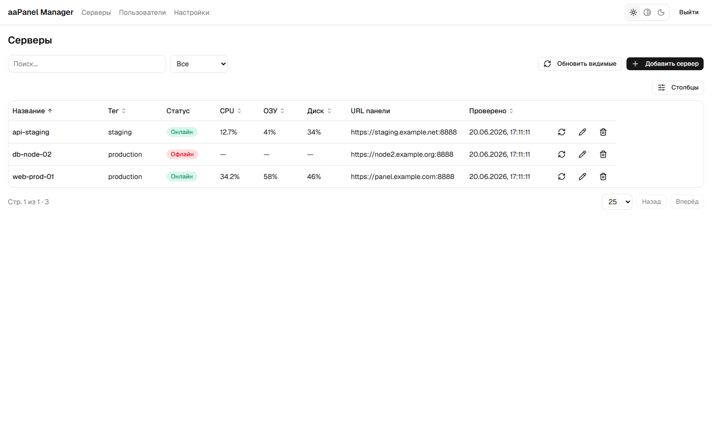
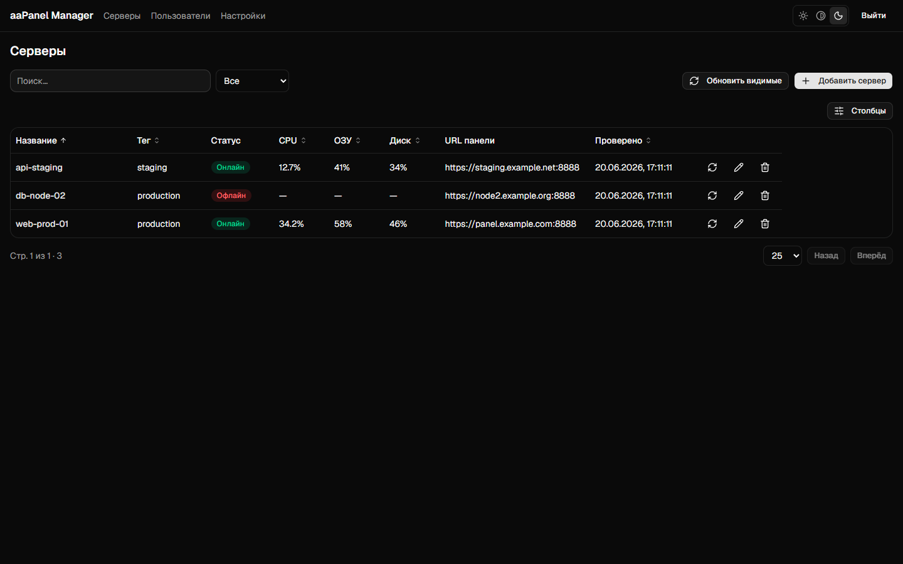
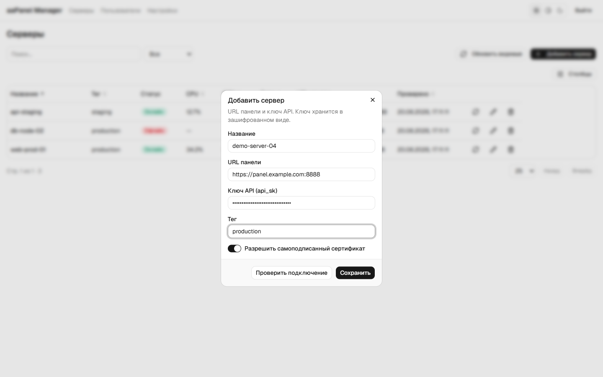
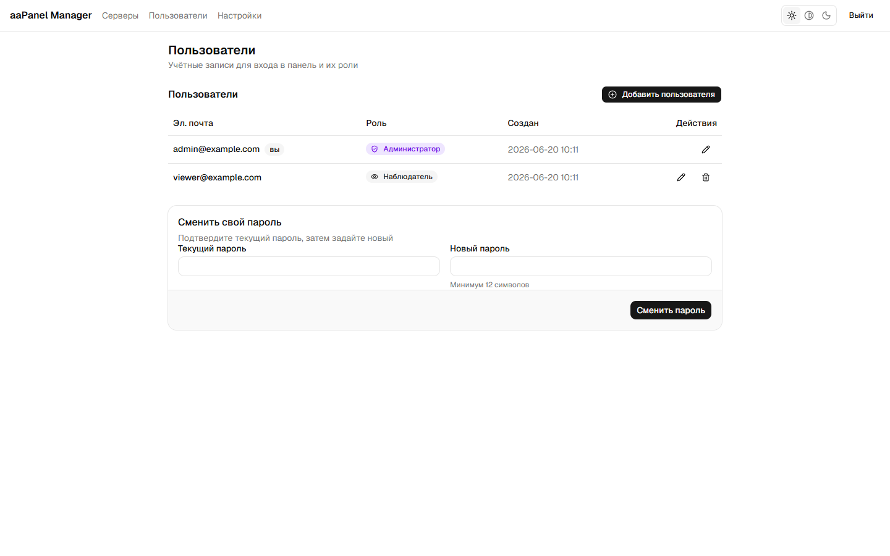
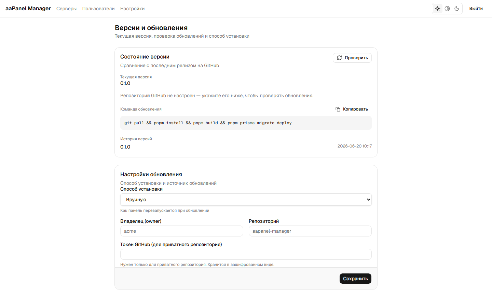

# aaPanel Manager

> Self-hosted панель для управления вашими серверами **aaPanel** из одного места — на базе самой полной **проверенной документации API** aaPanel (Node.js-проекты, мониторинг сервера и другое).

🌍 **Язык:** **Русский** · [English](README.md)

[](https://github.com/vsgrade/aapanel-manager/actions/workflows/ci.yml)
[](LICENSE)

---



## Зачем это

[aaPanel](https://www.aapanel.com/) (международная версия панели BT Panel) — популярная веб-панель управления Linux-сервером, но её HTTP API описан лишь частично, а при нескольких панелях приходится заходить в каждую отдельно. Этот репозиторий решает обе проблемы:

1. **Приложение** — self-hosted панель на Next.js, которая управляет многими серверами aaPanel через защищённый **бэкенд-прокси**. Браузер напрямую с панелью не общается; секреты `api_sk` хранятся **зашифрованными на твоём сервере**.
2. **Документация** — реальные, **проверенные** примеры запросов и ответов API aaPanel, включая то, что официальная дока не описывает (в частности, управление Node.js-проектами).

**Главная находка:** один постоянный ключ `api_sk`, используемый на корне панели, покрывает **и** официальные эндпоинты (`/system?action=…`), **и** внутренние (`/v2/project/nodejs/…`) — то есть всем можно управлять одним стабильным ключом.

## Возможности приложения

- 🖥️ **Мульти-сервер** — добавление / изменение / удаление серверов aaPanel; `api_sk` шифруется в покое (AES-256-GCM)
- 🟢 **Node.js-проекты** — список, статус, инфо, логи, старт / стоп / рестарт, создание / изменение / удаление
- 📊 **Живой мониторинг** — CPU / RAM / диск с автообновлением (фоновый опрос в процессе + Server-Sent Events)
- 👥 **Пользователи и роли** — admin / viewer, управление пользователями, смена своего пароля
- 🔒 **Безопасно по умолчанию** — бэкенд-прокси; секреты не попадают в браузер; аудит всех изменений
- 🌐 **i18n и темы** — английский / русский, светлая / тёмная

> **Статус:** в активной разработке. Мульти-сервер, Node.js-проекты, мониторинг и управление пользователями работают уже сейчас. Базы данных, файлы, FTP, cron и firewall пока есть в документации API и в планах для приложения.

## Скриншоты

|  |  |
|---|---|
| **Серверы (тёмная тема)**<br> | **Добавление сервера**<br> |
| **Пользователи и роли**<br> | **Версии и обновления**<br> |

## Стек

Next.js 16 (App Router · React Server Components · Server Actions) · React 19 · TypeScript · Prisma 7 + PostgreSQL · Auth.js v5 · Tailwind v4 · Docker.

## Быстрый старт (разработка)

**Требования:** Node 24, pnpm 11 (`corepack enable`), PostgreSQL.

```bash
git clone https://github.com/vsgrade/aapanel-manager.git
cd aapanel-manager/web
pnpm install
cp .env.example .env          # задай DATABASE_URL, AUTH_SECRET, APP_ENCRYPTION_KEY
pnpm prisma migrate deploy
pnpm dev                      # http://localhost:3000
```

Для продакшена (Docker-образы, релизы по тегу, самообновление) см. [docs/RELEASING.md](docs/RELEASING.md).

## Документация API

| Документ | Содержание |
|----------|-----------|
| 📖 [Обзор](docs/ru/overview.md) | Что такое API aaPanel; две схемы авторизации; рецепт «разведка→исполнение» |
| 🔑 [Аутентификация](docs/ru/authentication.md) | Ключ `api_sk` (рекомендуется) vs сессия; подпись запроса; SSL; безопасность |
| 🟢 [Node.js-проекты](docs/ru/nodejs-projects.md) | список, инфо, команды, версии, старт/стоп — с реальными ответами |
| 🌐 [Сайты (PHP/WP)](docs/ru/sites.md) | список, создание, удаление сайтов |
| 🗄️ [Базы данных](docs/ru/databases.md) | MySQL + PostgreSQL CRUD (у каждого движка свой API) |
| 📁 [Файлы (Файловый менеджер)](docs/ru/files.md) | список/создание/правка/перемещение/копирование/права/архив/загрузка/загрузка по URL/удаление + корзина |
| 📂 [FTP](docs/ru/ftp.md) | FTP-пользователи: список, создание, смена пароля, вкл/выкл, удаление |
| ⏱️ [Планировщик (Cron)](docs/ru/cron.md) | задачи: список, создание, запуск, логи, вкл/выкл, удаление |
| 🛡️ [Firewall (Безопасность)](docs/ru/firewall.md) | чтение состояния: статус, сводка, правила портов (запись — рецептом) |
| 📊 [Мониторинг сервера](docs/ru/system-monitoring.md) | CPU / RAM / диск (`GetSystemTotal`, `GetDiskInfo`) |

## Пример кода

Готовая обёртка на TypeScript (авторизация ключом **или** сессией): [`examples/javascript/aapanel-client.ts`](examples/javascript/aapanel-client.ts).

```ts
import { AaPanelClient } from "./examples/javascript/aapanel-client";

const client = new AaPanelClient({
  baseUrl: process.env.AAPANEL_BASE_URL!,                  // https://<сервер>:<порт> (корень!)
  auth: { mode: "apiKey", apiSk: process.env.AAPANEL_API_SK! },
  insecureTLS: true,                                       // самоподписанный сертификат
});

await client.listProjects();        // имена, статус (запущен/остановлен), CPU/RAM
await client.getSystemTotal();      // CPU / RAM / ядра сервера
await client.startProject("myapp");
```

> ⚠️ **Только на стороне сервера.** `api_sk` даёт полный доступ к серверу — никогда не показывай его в коде браузера. См. [Аутентификация → Безопасность](docs/ru/authentication.md#безопасность).

## Рецепт (официальный способ aaPanel)

Функция не описана? Открой панель → DevTools (Network) → нажми её → посмотри запрос → повтори **тот же путь и тело** с авторизацией `api_sk`. См. [Аутентификация](docs/ru/authentication.md#-рецепт-разведка--исполнение-официальный-способ-aapanel).

## Планы

**Документация API**

- [x] Управление Node.js-проектами (создание, список, инфо, команды, версии, старт/стоп/рестарт, изменение, удаление)
- [x] Сайты (PHP/WP): список, создание, удаление
- [x] Базы данных (MySQL + PostgreSQL, CRUD)
- [x] Файлы / Файловый менеджер (CRUD, права, архивы, загрузка, загрузка по URL, корзина)
- [x] FTP-пользователи (CRUD, пароль, вкл/выкл)
- [x] Планировщик / Cron (CRUD, запуск, логи, вкл/выкл)
- [x] Firewall (чтение состояния: статус, сводка, правила портов — запись рецептом)
- [x] Мониторинг сервера (CPU/RAM/диск)
- [x] Проверено: `api_sk` покрывает и внутренние эндпоинты
- [ ] Другие модули (SSL, домены, бэкапы)

**Приложение**

- [x] Управление несколькими серверами (шифрование `api_sk`, проверка подключения, аудит)
- [x] Node.js-проекты (CRUD + контроль + логи)
- [x] Живой мониторинг (фоновый опрос в процессе + SSE)
- [x] Пользователи и роли, аутентификация
- [x] Отображение версии + настройки обновлений
- [ ] Разделы Базы данных / Файлы / FTP / Cron / Firewall в приложении
- [ ] Действия обновления / отката

## Дисклеймер

Документация неофициальная. Проверено на aaPanel v8; поведение может меняться между версиями — сверяйтесь со своей панелью. Официальная дока: [aapanel.com/docs](https://www.aapanel.com/docs/).

## Лицензия

[MIT](LICENSE)
